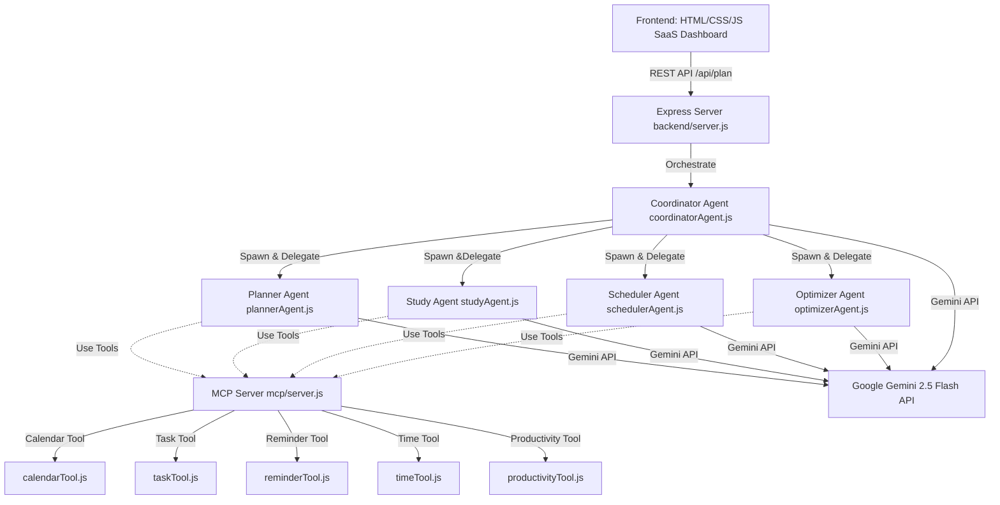

# 🚀 LifePilot AI
### Kaggle's AI Agents: Intensive Vibe Coding Capstone (Concierge Track)

LifePilot AI is a modern personal concierge web application that helps users organize daily tasks, study sessions, exams, goals, and workloads.

It coordinates a team of **four specialized AI agents** (Planner, Study Coach, Life Scheduler, and Task Optimizer) working together under a **Coordinator Agent**. All agents communicate with a local **Model Context Protocol (MCP) Server** to access utilities like calendars, Eisenhower task prioritization matrices, timers, and burnout metrics.

---

# 🏗️ Architecture Design



---


# 🌟 Key Capstone Concepts Demonstrated

## 1. Google ADK Multi-Agent Orchestration

- **Planner Agent**
  - Breaks goals down into task cards.

- **Study Coach Agent**
  - Plans exam preparation using spaced repetition and the Feynman technique.

- **Life Scheduler Agent**
  - Creates daily timetables matching study sessions and personal chores.

- **Task Optimizer Agent**
  - Rearranges tasks into peak energy periods and monitors burnout.

- **Coordinator Agent**
  - Acts as the orchestration pipeline and produces executive briefings.

---

## 2. Model Context Protocol (MCP) Server

- Hosts **5 specific tools** conforming to the standard MCP schema.
- Integrates **StdioServerTransport** for external MCP client execution (such as Claude Desktop).
- Exposes a local bridge execution interface.

---

## 3. Security Principles

- Sanitizes user inputs against Cross-Site Scripting (XSS).
- Protects against system parameter overflow.
- Includes **Prompt Injection Protection** to ignore malicious override instructions.
- Stores API credentials securely in `.env`.
- Supports a robust **Mock AI Mode** for offline demonstrations.

---

## 4. Rich Visual Aesthetics

- Glassmorphic responsive UI
- Dynamic calendar visualization
- Interactive checklists
- Real-time SVG progress rings
- Responsive tables
- Native dark mode using CSS variables

---

# 📂 Project Structure

```text
lifepilot-ai/
├── frontend/                 # Client SPA Dashboard
│   ├── index.html            # Core layout & pages
│   ├── style.css             # Glassmorphic responsive styling
│   └── script.js             # API integrations & local databases
│
├── backend/                  # Node.js & Express API Gateway
│   ├── agents/               # Multi-Agent Implementations
│   │   ├── aiHelper.js       # Gemini caller, sanitizers & mock fallbacks
│   │   ├── plannerAgent.js
│   │   ├── studyAgent.js
│   │   ├── schedulerAgent.js
│   │   ├── optimizerAgent.js
│   │   └── coordinatorAgent.js
│   │
│   ├── mcp/                  # MCP Server
│   │   ├── server.js         # Stdio transport listener
│   │   └── tools/
│   │       ├── calendarTool.js
│   │       ├── taskTool.js
│   │       ├── reminderTool.js
│   │       ├── timeTool.js
│   │       └── productivityTool.js
│   │
│   ├── routes/
│   │   └── agentRoutes.js    # Express REST API Routes
│   │
│   ├── server.js             # Main server entrypoint
│   ├── .env                  # Port, API keys & mock configs
│   ├── .env.example
│   └── package.json          # Node dependencies
│
├── package.json              # Root workspace package.json
└── README.md                 # Project Documentation
```

---

# 🛠️ Tech Stack

| Category | Technology |
|----------|------------|
| **Frontend** | HTML5, CSS3, Vanilla JavaScript |
| **Backend** | Node.js, Express, dotenv |
| **AI Integration** | `@google/genai` (Gemini 2.5 Flash / Gemini 1.5 Flash) |
| **Tool Protocol** | `@modelcontextprotocol/sdk` |

---

# 🚀 Quick Start (Local Setup)

The application has been configured with an **Offline Demo Mode (`ENABLE_MOCK_AI=true`)**, allowing it to run without a Gemini API key.

## Prerequisites

- Node.js (v18 or higher recommended)

---

## Installation

Open the project folder in Visual Studio Code and install dependencies:

```bash
npm install
```

---

## Running the Application

```bash
npm start
```

Once the server starts, open:

**http://localhost:3000**

---

# ⚙️ Environment Variables

Copy `.env.example` to `.env` inside:

```text
lifepilot-ai/backend/
```

Then configure:

```ini
# Express Port
PORT=3000

# Server Environment
NODE_ENV=development

# Gemini API Key (Optional)
GEMINI_API_KEY=your_gemini_api_key_here

# Enable Mock AI
ENABLE_MOCK_AI=true
```

---

## Switching to Live Gemini AI

1. Obtain an API key from Google AI Studio.
2. Set:

```ini
GEMINI_API_KEY=your_actual_key
```

3. Change:

```ini
ENABLE_MOCK_AI=false
```

4. Restart the server.

---

# 🔧 Future Improvements

- Database syncing with PostgreSQL or MongoDB
- Google Calendar OAuth 2.0 integration
- Gemini multimodal audio recaps for daily summaries
