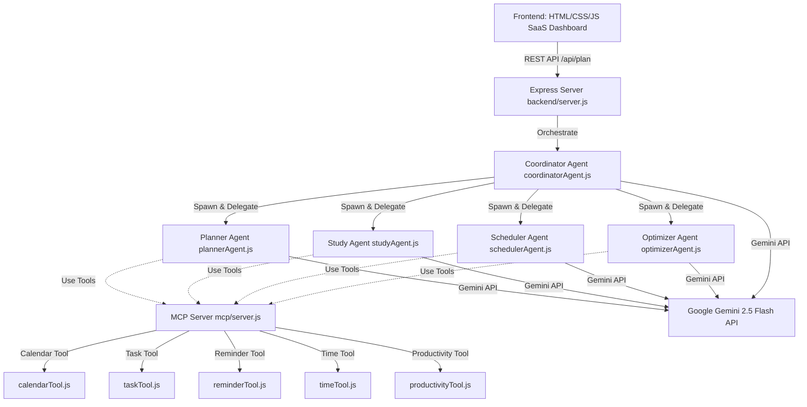

# LifePilot AI 🚀
### Kaggle's AI Agents: Intensive Vibe Coding Capstone (Concierge Track)

LifePilot AI is a modern personal concierge web application that helps users organize daily tasks, study sessions, exams, goals, and workloads. It coordinates a team of four specialized AI agents (Planner, Study Coach, Life Scheduler, and Task Optimizer) working together under a Coordinator Agent. All agents communicate with a local Model Context Protocol (MCP) server to access utilities like calendars, Eisenhower task prioritization matrices, timers, and burnout metrics.

---

## 🏗️ Architecture Design



---

## 🌟 Key Capstone Concepts Demonstrated

1. **Google ADK Multi-Agent Orchestration**:
   - **Planner Agent**: Breaks goals down into task cards.
   - **Study Coach Agent**: Plans exam prep methods (spaced repetition, Feynman technique).
   - **Life Scheduler Agent**: Creates daily timetables, matching chores and study.
   - **Task Optimizer Agent**: Shifts tasks to peak energy slots, checks burnout.
   - **Coordinator Agent**: Serves as the pipeline controller and synthesizes executive briefings.
2. **Model Context Protocol (MCP) Server**:
   - Hosts 5 specific tools conforming to standard MCP schema validation.
   - Integrates `StdioServerTransport` for external MCP client execution (like Claude Desktop) and exposes local bridge execution.
3. **Security Principles**:
   - Sanitizes inputs against cross-site scripting (XSS) and system parameters overflow.
   - Includes **Prompt Injection Protection** inside prompts to discard override instructions.
   - Restricts API credentials to environment files (`.env`), including a robust mock-AI mode fallback for offline demoing.
4. **Rich Visual Aesthetics**:
   - Fluid glassmorphic UI, responsive tables, dynamic calendar nodes, and interactive checklists with real-time SVG progress ring updates.
   - Native dark mode support using CSS variables.

---

## 📂 Project Structure

```text
lifepilot-ai/
├── frontend/                 # Client SPA Dashboard
│   ├── index.html            # Core layout & pages
│   ├── style.css             # Glassmorphic responsive styling
│   └── script.js             # API integrations & local databases
├── backend/                  # Node.js & Express API Gateway
│   ├── agents/               # Multi-Agent Implementations
│   │   ├── aiHelper.js       # Gemini caller, sanitizers & mock fallbacks
│   │   ├── plannerAgent.js
│   │   ├── studyAgent.js
│   │   ├── schedulerAgent.js
│   │   ├── optimizerAgent.js
│   │   └── coordinatorAgent.js
│   ├── mcp/                  # MCP Server
│   │   ├── server.js         # Stdio transport listener
│   │   └── tools/            # Modular MCP tools
│   │       ├── calendarTool.js
│   │       ├── taskTool.js
│   │       ├── reminderTool.js
│   │       ├── timeTool.js
│   │       └── productivityTool.js
│   ├── routes/
│   │   └── agentRoutes.js    # Express REST API Routes
│   ├── server.js             # Main server entrypoint
│   ├── .env                  # Port, API keys & mock configs
│   ├── .env.example
│   └── package.json          # Node dependencies
├── package.json              # Root workspace package.json (command proxy)
└── README.md                 # Project Documentation
```

---

## 🛠️ Tech Stack

- **Frontend**: HTML5, CSS3, Vanilla JS
- **Backend**: Node.js, Express, dotenv
- **AI Integration**: `@google/genai` (Gemini 2.5 Flash / Gemini 1.5 Flash)
- **Tool Protocol**: `@modelcontextprotocol/sdk` (Model Context Protocol)

---

## 🚀 Quick Start (Local Setup)

The application has been configured with an **offline Demo Mode (`ENABLE_MOCK_AI=true`)** which runs out of the box without requiring a Gemini API key.

### Prerequisites
- Node.js (v18 or higher recommended)

### Installation
1. Open the project folder in Visual Studio Code.
2. In the terminal, run the following command to install the workspace and backend dependencies:
   ```bash
   npm install
   ```

### Running the App
Start the Express server and serve the frontend:
```bash
npm start
```

Once running, open your web browser and navigate to:
👉 **[http://localhost:3000](http://localhost:3000)**

---

## ⚙️ Environment Variables

Copy `.env.example` to `.env` inside `lifepilot-ai/backend/` to configure settings:

```ini
# Express Port
PORT=3000

# Server Environment
NODE_ENV=development

# Gemini API Key (Optional: for live LLM orchestration)
GEMINI_API_KEY=your_gemini_api_key_here

# Enable Mock Mode for AI when no API key is present (true/false)
ENABLE_MOCK_AI=true
```

To switch from Demo Mode to live Gemini AI:
1. Obtain an API Key from [Google AI Studio](https://aistudio.google.com/).
2. Set `GEMINI_API_KEY=your_actual_key` in the `.env` file.
3. Set `ENABLE_MOCK_AI=false` in the `.env` file.
4. Restart the server.

---

## 🔧 Future Improvements

- **Database Syncing**: Migrate task and goal arrays from frontend state storage to persistent PostgreSQL or MongoDB databases.
- **Google Calendar OAuth**: Connect the Calendar Tool directly to the user's real Google Calendar using OAuth 2.0.
- **Audio Recaps**: Integrate Gemini's multimodal audio API to read daily briefs and suggestions aloud to the user.
